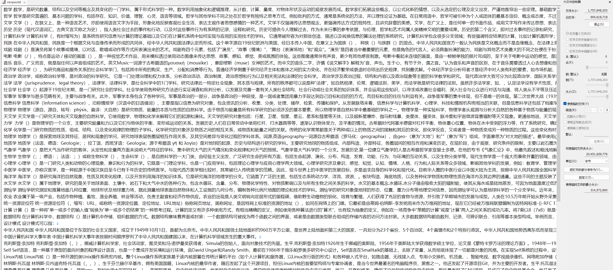

# how-to-train-tokenizer

怎么训练一个LLM分词器

## SentencePiece简介

- SentencePiece 首先将所有输入转换为 unicode 字符。这意味着它不必担心不同的语言、字符或符号，可以以相同的方式处理所有输入；
- 空白也被当作普通符号来处理。Sentencepiece显式地将空白作为基本标记来处理，用一个元符号 “▁”（ U+2581 ）转义空白，这样就可以实现简单地decoding；
- Sentencepiece 可以直接从 raw text 进行训练； 
- 支持 BPE 和 UniLM 训练方法。

## 代码说明
```text
├── data
│     └── corpus.txt 训练语料
├── llama
│     ├── tokenizer_checklist.chk
│     └── tokenizer.model
├── merged_tokenizer_hf 合并结果 hf格式
│     ├── special_tokens_map.json
│     ├── tokenizer_config.json
│     └── tokenizer.model
├── merged_tokenizer_sp
│     └── open_llama.model # 
├── merge_tokenizer
│     └── tokenizer.model
├── open_llama.model 训练的sp模型
├── open_llama.vocab 训练的sp词汇表
├── README.md
├── step1_make_corpus.py 基于中文Wikipedia数据准备训练语料
├── step2_train_tokenzier.py  训练分词器
├── step3_tokenzier_segment.py 测试训练后的模型，包括编码和解码测试样例
└── step4_merge_tokenizers.py 与原版llama的分词器进行合并，得到hf格式的tokenizer

```

## 测试效果
```text
32000
Before:32000
New model pieces: 77526
Chinese-LLaMA tokenizer has been saved to merged_tokenizer_hf
['<s>', '</s>', '<unk>']
[1, 2, 0]
{'bos_token': '<s>', 'eos_token': '</s>', 'unk_token': '<unk>'}
Test text:
 白日依山尽，黄河入海流。欲穷千里目，更上一层楼。
The primary use of LLaMA is research on large language models, including
Tokenized by LLaMA tokenizer:['▁', '白', '日', '<0xE4>', '<0xBE>', '<0x9D>', '山', '<0xE5>', '<0xB0>', '<0xBD>', '，', '黄', '河', '入', '海', '流', '。', '<0xE6>', '<0xAC>', '<0xB2>', '<0xE7>', '<0xA9>', '<0xB7>', '千', '里', '目', '，', '更', '上', '一', '<0xE5>', '<0xB1>', '<0x82>', '<0xE6>', '<0xA5>', '<0xBC>', '。', '<0x0A>', 'The', '▁primary', '▁use', '▁of', '▁L', 'La', 'MA', '▁is', '▁research', '▁on', '▁large', '▁language', '▁models', ',', '▁including']
Tokenized by Chinese-LLaMA tokenizer:['▁白', '日', '依', '山', '尽', '，', '黄河', '入海', '流', '。', '欲', '穷', '千里', '目', '，', '更', '上一', '层楼', '。', '<0x0A>', 'The', '▁primary', '▁use', '▁of', '▁L', 'La', 'MA', '▁is', '▁research', '▁on', '▁large', '▁language', '▁models', ',', '▁including']

```